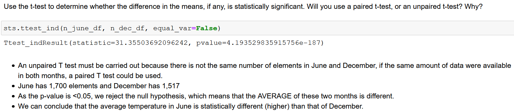

# Analysis

# SQL Alchemy Challenge

## Surfs Up!

Congratulations! You've decided to treat yourself to a long holiday vacation in Honolulu, Hawaii! To help with your trip planning, you need to do some climate analysis on the area. The following outlines what you need to do. 


## Codebase for Database connection,  Analysis is [here](Homework-sqlalchemy-JLDA.ipynb)

# Analysis

## Precipitation Analysis

### Design a query to retrieve the last 12 months of precipitation data and plot the results
```
last_date = engine.execute('SELECT max(date) FROM measurement').fetchone()
last_12 = (dt.datetime.strptime(last_date[0], '%Y-%m-%d') - dt.timedelta(days=365)).date()
### Perform a query to retrieve the data and precipitation scores
precip_data = session.query(Measurement.date, Measurement.prcp).\
    filter(Measurement.date >= last_12).\
order_by(Measurement.date).all()
precip_data
### Save the query results as a Pandas DataFrame and set the index to the date column
precip_df = pd.DataFrame(precip_data)
precip_df = precip_df.rename(columns={"prcp":"Precip"})
precip_df.head()
### Use Pandas Plotting with Matplotlib to plot the data
ax = precip_df.plot(figsize=(12,8))
plt.legend(bbox_to_anchor=(.6,1.001), fontsize="16")
ax.set_title(f"Precipitation Analysis ({(last_12)} to {last_date[0]})")
ax.xaxis.set_major_formatter(plt.NullFormatter())
ax.set_xlabel('Date', size=18)
plt.ylabel("Precipitation (Inches)", size=18)
plt.savefig("./Images/Precipitation_12m.png")
plt.show()
```
### This is the Precipitation Plot Analysis for 12 months


    


## Station Analysis

### Design a query to show how many stations are available in this dataset?
```
total_stats = session.query(Station.id).count()
print("Stations availables: {}".format(total_stats))
```
### List the stations and the counts in descending order.
```
active_stats = session.query(Measurement.station,
                  func.count(Measurement.station))\
.group_by(Measurement.station)\
.order_by(func.count(Measurement.station).desc()).limit(6).all()
print(f"The most active stations are: ")
for station in active_stats:
    print(f"   {station[0]} with total count: {station[1]} ")   
```
### highest temperature recorded, and average temperature most active station?
```
new_station = active_stats[0][0]
summ_stat=session.query(func.min(Measurement.tobs), func.avg(Measurement.tobs), func.max(Measurement.tobs)).\
                filter(Measurement.station == new_station).all()

print(f" Most Active Station ID: {active_stats[0][0]}")
print(f" Minimum Tempeture: {summ_stat[0][0]}")
print(f" Average Tempeture: {summ_stat[0][1]}")
print(f" Maximum Tempeture: {summ_stat[0][2]}")
```
### Query the last 12 months of temperature observation data for this station and plot the results as a histogram
```
temp_high = session.query(Measurement.tobs).\
                filter(Measurement.station==active_stats[0][0]).\
                filter(Measurement.date >= last_12).\
                                order_by(Measurement.date.desc()).all()
temp_high_df = pd.DataFrame(temp_high)
temp_high_df.head()
```
### Use Pandas Plotting with Matplotlib to plot the data
```
temp_high_df.plot.hist(by='station', bins=12, figsize=(12,8))
plt.grid()
plt.title(f"Temperatures Obs ({(last_12)} to {last_date[0]}) Station: { active_stats[0][0]}")
plt.xlabel("Temperature Reported", fontsize=16)
plt.legend(bbox_to_anchor=(1,1), fontsize=16)
plt.savefig("./Images/BestStatTemp.png")
plt.show()
```


- - -

# Bonus Challenge Analysis

## Temperature Analysis I




Hawaii is reputed to enjoy mild weather all year. Is there a meaningful difference between the temperature in, for example, June and December?

- It's almost 4 degrees Fahrenheit ... even though for me this difference is not really relevant, statistically speaking it is. 
```
june_df = pd.DataFrame(session.query(Measurement.date, Measurement.tobs).\
             filter(func.strftime('%m', Measurement.date)=='06').order_by(Measurement.date).all(), columns=['Date', 'Temp'])

dec_df = pd.DataFrame(session.query(Measurement.date, Measurement.tobs).\
             filter(func.strftime('%m', Measurement.date)=='12').order_by(Measurement.date).all(), columns=['Date', 'Temp'])

june_df.set_index('Date', inplace=True)
dec_df.set_index('Date', inplace=True)
```
### Combine June & Dec DF
```
combined_jd_df = june_df.join(dec_df, how='outer', lsuffix='_June', rsuffix='_Dec')
#Sort index
combined_jd_df.sort_index(inplace=True)
combined_jd_df.info()
```
- Identify the average temperature in June at all stations across all available years in the dataset. Do the same for December temperature.
```
n_june_df=combined_jd_df['Temp_June'][combined_jd_df['Temp_June'].notna()]
n_dec_df=combined_jd_df['Temp_Dec'][combined_jd_df['Temp_Dec'].notna()]
avg_t_june = n_june_df.mean()
avg_t_dec = n_dec_df.mean()
print(f" Average Temp in June is: {avg_t_june}")
print(f" Average Temp in Dec is: {avg_t_dec}")
print(f" The difference of Temperature in Hawaii between Jun-Dec is: {avg_t_june-avg_t_dec}")
```


Use the t-test to determine whether the difference in the means, if any, is statistically significant. Will you use a paired t-test, or an unpaired t-test? Why?


```
sts.ttest_ind(n_june_df, n_dec_df, equal_var=False)
```
- An unpaired T test must be carried out because there is not the same number of elements in June and December, if the same amount of data were available in both months, a paired T test could be used.
- June has 1,700 elements and December has 1,517
- As the p-value is <0.05, we reject the null hypothesis, which means that the AVERAGE of these two months is different.
- We can conclude that the average temperature in June is statistically different (higher) than that of December.

## Temperature Analysis II


### Plot the results from your previous query as a bar chart. 
```
avg_temp.plot(kind='bar', yerr=tmin_tmax_temp, figsize=(6,8), alpha=0.5, color='cyan')
plt.title("Trip Avg Temp", fontsize=20)
plt.ylabel("Temp (F)", fontsize=15)
plt.xticks([])
plt.ylim((0,105))
plt.grid( linestyle='-', linewidth=4)
plt.savefig("./Images/TripAvgTemp.png")
plt.show()
```


### Calculate the total amount of rainfall per weather station for your trip dates using the previous year's matching dates.
```
tot_precip_stat = session.query(Measurement.station,  func.sum(Measurement.prcp).label('Total_Precip')).\
filter((Measurement.date<=e_date) &(Measurement.date>=s_date)).\
group_by(Measurement.station).order_by(func.avg(Measurement.prcp).desc()).subquery()

results = session.query(tot_precip_stat.c.station, Station.name, Station.latitude, Station.longitude, Station.elevation, tot_precip_stat.c.Total_Precip).\
join(Station, Station.station == tot_precip_stat.c.station, isouter=True).all()

pd.DataFrame(results, columns=['Station', 'Station Name', 'Lat', 'Lng', 'Elevation', 'Total_Precip'])
```


# Calculate the daily normals for your trip
```
normals = []
val_dates = dt.datetime.strptime(e_date, "%Y-%m-%d") - dt.datetime.strptime(s_date, "%Y-%m-%d")
dates = []
for val in range(val_dates.days+1):
    date = dt.datetime.strptime(s_date, "%Y-%m-%d") + dt.timedelta(days=val)
    dates.append(dt.datetime.strftime(date, "%Y-%m-%d"))
    tmin,tavg,tmax = np.ravel(daily_normals(dt.datetime.strftime(date, "%m-%d")))
    normals.append((tmin,tavg,tmax))
```


### Plot the daily normals as an area plot with `stacked=False`
```
fig, ax = plt.subplots(figsize=(10,6))
normals_df.plot.area(ax=ax, stacked=False, alpha=0.4)
plt.xticks(range(len(dates)), dates, rotation=90, ha='right')
plt.xlim((0,len(dates)-1))
plt.ylabel("Temperature")
plt.title(f"Daily Normals of Temperature for a Trip\n {s_date} to {e_date}", fontsize=20, y=1)
plt.tight_layout()
plt.savefig('./Images/NormalsTempTrip.png', bbox_inches = "tight" )
```


