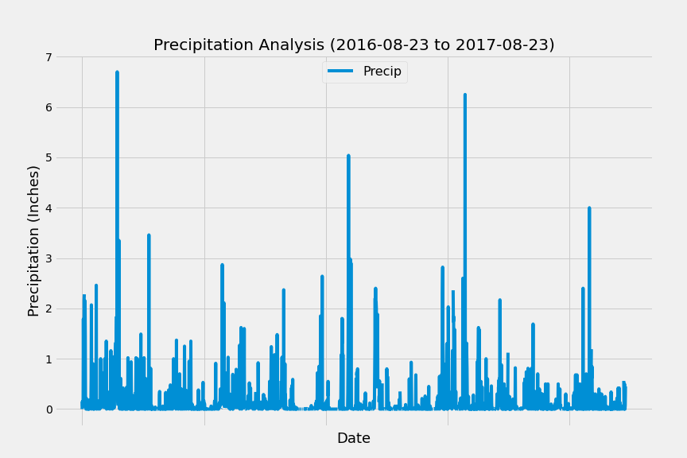
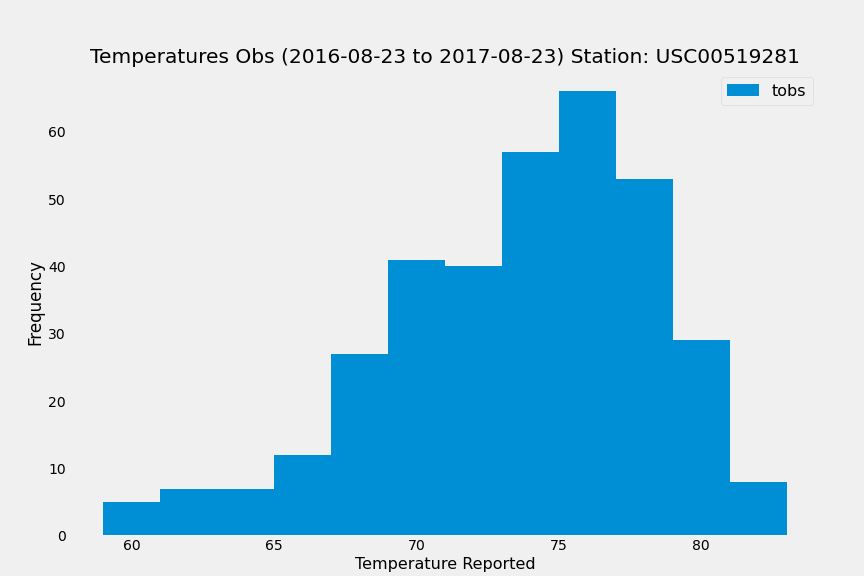
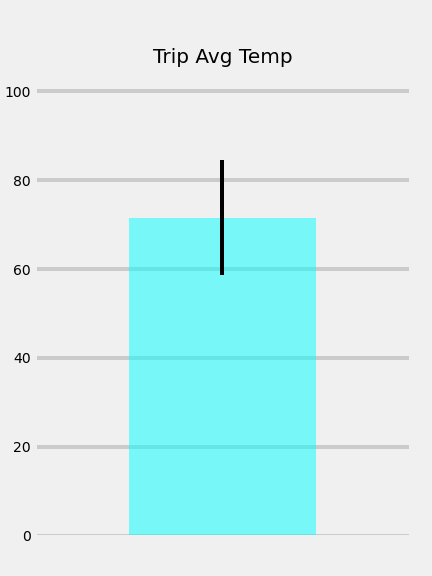
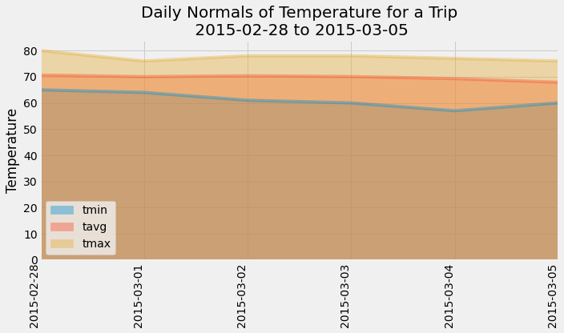

#SQL Alchemy Challenge

## Surfs Up!

Congratulations! You've decided to treat yourself to a long holiday vacation in Honolulu, Hawaii! To help with your trip planning, you need to do some climate analysis on the area. The following outlines what you need to do. 

![] (Images/Hawaii1.png)

## Codebase for Database connection,  Analysis is [here](Homework-sqlalchemy-JLDA.ipynb)

# Analysis

## Precipitation Analysis

    
    

## Station Analysis

    

- - -

## Additional Analysis

### Temperature Analysis I

    

### Temperature Analysis II

    

    

